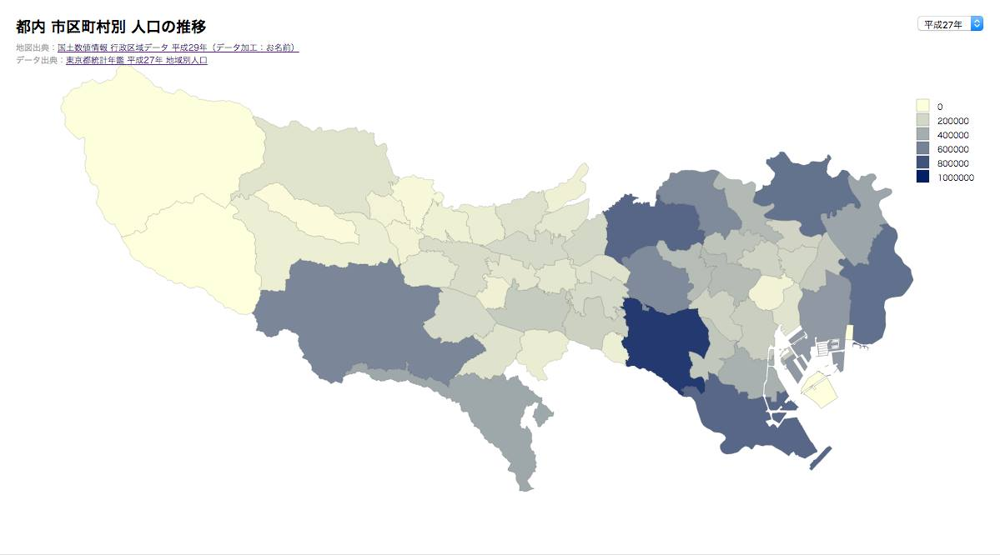

# データビジュアライゼーション講習用ソースコード
## コロプレス・マップ

### 使用コース
- 【D3.js】GeoJsonファイルとテーマデータを読み込み、主題図の作成

### 使用データ

- tokyo.topojson
	- 国土数値情報 行政区域データ 平成29年（データ加工：矢崎裕一） 
	- http://www.gsi.go.jp/kankyochiri/gm_jpn.html
- population.tsv
	- 東京都統計年鑑　平成27年度　地域別人口
	- http://www.toukei.metro.tokyo.jp/tnenkan/2015/tn15q3i002.htm